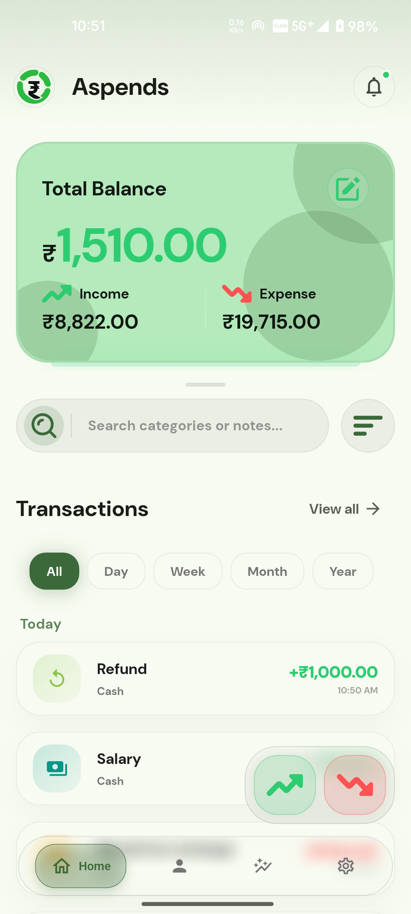
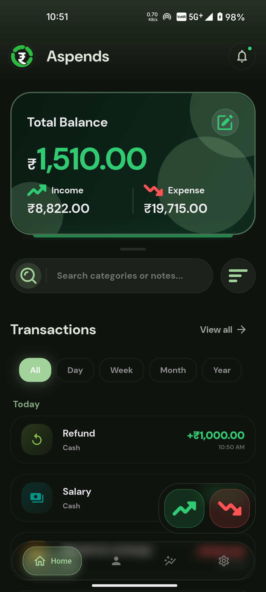
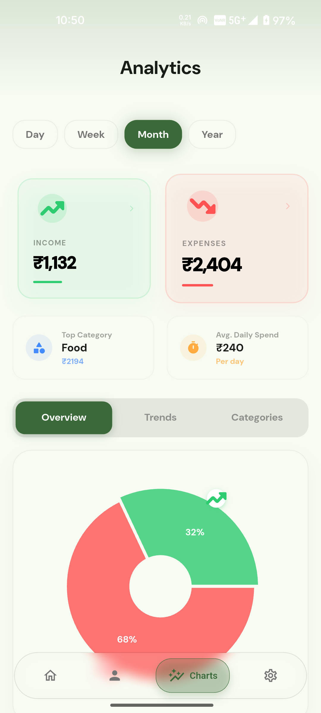
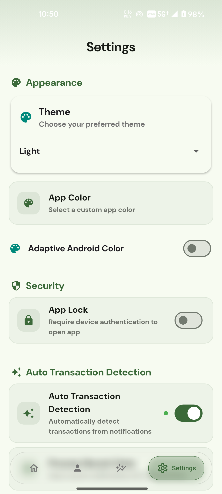

# 🎨 Aspend

**Aspend** is a modern Flutter application that embraces **Material You** design principles with **dynamic color theming** for an immersive and personalized user experience.

---

## ✨ Features

- 🖌️ Material 3 (Material You) design
- 🎨 Dynamic color theming based on system settings
- ⚡ Smooth performance and responsive UI
- 📱 Cross-platform (Android, iOS, Web)
- 📊 Automatic transaction detection from SMS and notifications
- 🔒 Secure local storage with Hive

---

## 🚀 Getting Started

To run this project locally:

### 1. 📋 Prerequisites

Make sure you have the following installed:

- ✅ [Flutter SDK](https://docs.flutter.dev/get-started/install)
- ✅ Dart SDK
- ✅ IDE (VS Code, Android Studio, etc.)

### 2. 🛠 Installation

```bash
git clone https://github.com/sthrnilshaaa/aspend.git
cd aspend
flutter pub get
flutter run
```

---

## 📸 App Showcase

<div align="center">
  <table style="width:100%; border-collapse: collapse;">
    <tr>
      <td align="center" style="width: 50%; padding: 10px;">
        <br/>
        <b>☀️ Home - Light Mode</b>
      </td>
      <td align="center" style="width: 50%; padding: 10px;">
        <br/>
        <b>🌙 Home - Dark Mode</b>
      </td>
    </tr>
    <tr>
      <td align="center" style="width: 50%; padding: 10px;">
        <br/>
        <b>📊 Analysis & Insights</b>
      </td>
      <td align="center" style="width: 50%; padding: 10px;">
        <br/>
        <b>⚙️ Personalized Settings</b>
      </td>
    </tr>
  </table>
</div>

---

## 📚 Flutter Resources

If you're new to Flutter, here are some helpful links:

* [🧪 Write your first Flutter app](https://docs.flutter.dev/get-started/codelab)
* [🍳 Flutter Cookbook (UI examples)](https://docs.flutter.dev/cookbook)
* [📖 Flutter Docs & API Reference](https://docs.flutter.dev/)

---

## 🤝 Contributing

Have a suggestion or found a bug? Contributions are welcome!

1. Fork the repository
2. Create a branch (`git checkout -b feature-name`)
3. Commit your changes (`git commit -m 'Add new feature'`)
4. Push to the branch (`git push origin feature-name`)
5. Open a Pull Request

---

## 📄 License

This project is licensed under the MIT License – see the [LICENSE](LICENSE) file for details.

---

## 👤 Author

Created by **nilshaaa**
[GitHub](https://github.com/sthrnilshaaa)
